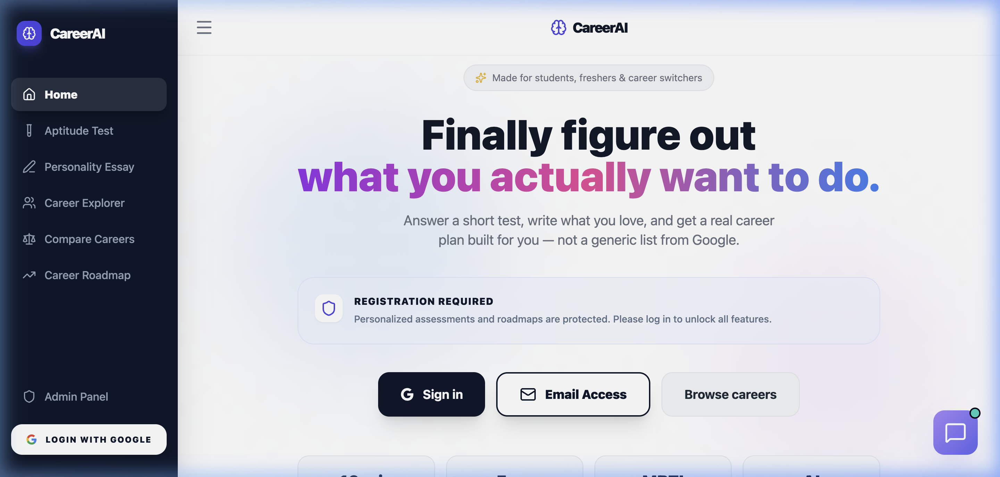
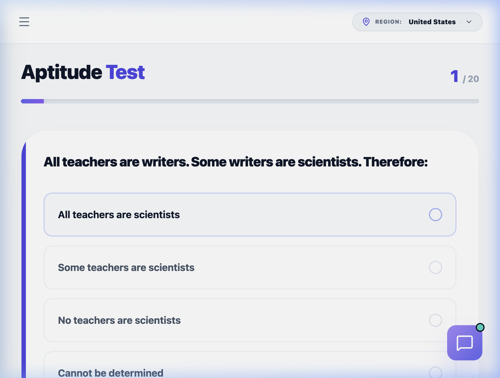
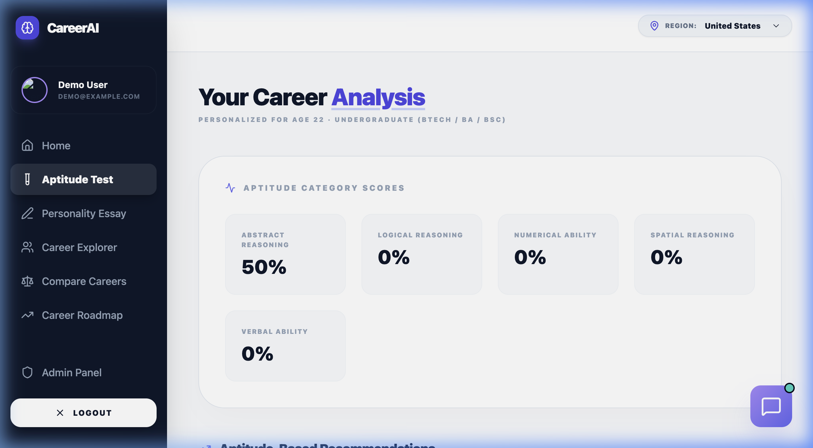

# AI POWERED CAREER COUNSELLING SYSTEM

## A Project Report

submitted in partial fulfillment for the award of the Degree of

**Bachelor of Technology**

in Department of Computer Science and Engineering(DS)

---

**Project Id:** SKIT/2022-2026/DS/XX

**Project Mentor:**
Ms. __________ (Assistant Professor)

**Submitted By:**

Sanyam Jain (22ESKCXXX)
Tanisha Aggarwal (22ESKCXXX)

---

Department of Computer Science and Engineering
Swami Keshvanand Institute of Technology, M & G, Jaipur
Rajasthan Technical University, Kota
Session 2025-2026

---

## CERTIFICATE

This is to certify that Mr. Sanyam Jain, a student of B.Tech (Computer Science & Engineering(DS)) 8th semester has submitted his Project Report entitled **"AI POWERED CAREER COUNSELLING SYSTEM"** under my guidance.

| Mentor | Coordinator |
|--------|-------------|
| Ms. __________ | Mr. __________ |
| Assistant Professor | Assistant Professor |
| Signature............ | Signature............ |

Department of Computer Science and Engineering(DS), SKIT, Jaipur

---

## CERTIFICATE

This is to certify that Ms. Tanisha Aggarwal, a student of B.Tech (Computer Science & Engineering(DS)) 8th semester has submitted her Project Report entitled **"AI POWERED CAREER COUNSELLING SYSTEM"** under my guidance.

| Mentor | Coordinator |
|--------|-------------|
| Ms. __________ | Mr. __________ |
| Assistant Professor | Assistant Professor |
| Signature............ | Signature............ |

Department of Computer Science and Engineering(DS), SKIT, Jaipur

---

## DECLARATION

We hereby declare that the report of the project entitled **"AI POWERED CAREER COUNSELLING SYSTEM"** is a record of an original work done by us at Swami Keshvanand Institute of Technology, Management and Gramothan, Jaipur under the mentorship of "Ms. __________" (Dept. of Computer Science and Engineering) and coordination of "Mr. __________" (Dept. of Computer Science and Engineering). This project report has been submitted as the proof of original work for the partial fulfillment of the requirement for the award of the degree of Bachelor of Technology (B.Tech) in the Department of Computer Science & Engineering(DS). It has not been submitted anywhere else, under any other program to the best of our knowledge and belief.

**Team Members & Signature**

- Sanyam Jain, 22ESKCXXX
- Tanisha Aggarwal, 22ESKCXXX

Department of Computer Science and Engineering(DS), SKIT, Jaipur

---

## Acknowledgement

A project of such a vast coverage cannot be realized without help from numerous sources and people in the organization. We take this opportunity to express our gratitude to all those who have been helping us in making this project successful.

We are highly indebted to our mentor Ms. __________. She has been a guide, motivator and source of inspiration for us to carry out the necessary proceedings for the project to be completed successfully. We also thank our project coordinator Mr. __________ for his co-operation, encouragement, valuable suggestions and critical remarks that galvanized our efforts in the right direction.

We would also like to convey our sincere thanks to Dr. Mehul Mahrishi, HOD, Department of Computer Science and Engineering, for facilitating, motivating and supporting us during each phase of development of the project. Also, we pay our sincere gratitude to all the Faculty Members of Swami Keshvanand Institute of Technology, Management and Gramothan, Jaipur and all our Colleagues for their co-operation and support.

Last but not least we would like to thank all those who have directly or indirectly helped and cooperated in accomplishing this project.

**Team Members:**

- Sanyam Jain, 22ESKCXXX
- Tanisha Aggarwal, 22ESKCXXX

Department of Computer Science and Engineering(DS), SKIT, Jaipur

---

## Abstract

The AI Powered Career Counselling System (CareerAI) is an interactive and intelligent web-based platform developed to assist students and self-learners in discovering personalised career paths through AI-driven analysis. The primary goal of this application was to provide users with adaptive aptitude testing, NLP-based essay analysis, sentiment scoring, and AI-generated career recommendations — all in under one second of response time.

Through CareerAI, users can take a 20-question adaptive aptitude test that dynamically adjusts difficulty based on performance, submit free-form career essays analysed by Google Gemini Flash 1.5 for zero-shot career classification, receive NLTK Vader sentiment analysis to gauge emotional confidence, explore 50+ career profiles with region-specific education paths, generate personalised 12-month career roadmaps, and interact with an AI Career Coach chatbot.

The goals of this application were to help learners overcome the common obstacles associated with traditional career counselling methods, such as high cost, limited accessibility, lack of personalisation, and scarcity of qualified human counsellors. By fusing multiple AI signals — cognitive aptitude scores, interest classification from unstructured essays, and emotional confidence metrics — into a unified recommendation engine, CareerAI delivers hyper-personalised career guidance at near-zero marginal cost per user.

The system is deployed as a full-stack web application with a React.js frontend hosted on Vercel and a Flask backend hosted on Render, with SQLite database, Google OAuth 2.0 authentication, and 20+ REST API endpoints. CareerAI demonstrates that production-quality, personalised career guidance can be made accessible to every student regardless of their socio-economic background.

Department of Computer Science and Engineering(DS), SKIT, Jaipur

---

## Table of Contents

1. **Introduction** — 2
   - 1.1 Problem Statement and Objective
   - 1.2 Literature Survey / Market Survey / Investigation and Analysis
   - 1.3 Introduction to Project
   - 1.4 Proposed Logic / Algorithm / Business Plan / Solution
   - 1.5 Scope of the Project
2. **Software Requirement Specification** — 6
   - 2.1 Overall Description
     - 2.1.1 Product Perspective
       - 2.1.1.1 System Interfaces
       - 2.1.1.2 User Interfaces
       - 2.1.1.3 Hardware Interfaces
       - 2.1.1.4 Software Interfaces
       - 2.1.1.5 Functional Requirement
       - 2.1.1.6 User Characteristics
       - 2.1.1.7 Constraints
       - 2.1.1.8 Assumption and Dependencies
3. **System Design Specification** — 12
   - 3.1 System Architecture
   - 3.2 Module Decomposition Description
   - 3.3 High Level Design Diagrams
     - 3.3.1 Use Case Diagram
     - 3.3.2 Class Diagram
     - 3.3.3 Data-Flow Diagram
     - 3.3.4 ER Diagram
4. **Methodology and Team** — 19
   - 4.1 Introduction to Agile Methodology
   - 4.2 Team Members, Roles & Responsibilities
5. **System Testing** — 24
   - 5.1 Introduction
   - 5.2 Types of Testing Performed
   - 5.3 Test Cases
6. **Project Screen Shots** — 33
7. **Conclusion and Future Scope** — 37
8. **UN Sustainable Development Goals** — 39
9. **References** — 41
10. **GitHub Link** — 43

---

## Chapter 1: Introduction

### 1.1 Problem Statement and Objective

The primary goal of the proposed AI Career Counselling System is to create a platform that supports users with an intelligent, interactive environment to discover personalised career paths through adaptive aptitude testing, NLP-based essay analysis, and AI-generated career recommendations. This will enable the user to understand their cognitive strengths, articulate their interests, receive data-driven career guidance, and build confidence toward their chosen career path.

There are many reasons that traditional career counselling methods present challenges: they are expensive (private counsellors cost ₹5,000+ per session), scarce (the student-to-counsellor ratio in India exceeds 500:1), and unable to scale. Over 51% of engineering graduates in India are not employable in their core field (NASSCOM, 2022). A LinkedIn global survey found that 74% of professionals experience career regret. The design of an AI-powered Career Counselling System addresses this need by delivering a digital solution that provides personalised, accessible, and immediate career guidance at zero cost.

The primary objectives of CareerAI are to: (1) measure cognitive ability through an adaptive, scientifically-grounded aptitude instrument, (2) capture authentic career interests through unstructured natural language input, (3) process these inputs through a reasoning model capable of synthesising them into actionable, personalised recommendations, and (4) deploy the system as a production-ready web application accessible to any student with an internet connection.

### 1.2 Literature Survey / Market Survey / Investigation and Analysis

The purpose of this survey was to identify existing approaches to AI-driven career guidance and understand their limitations to inform the design of CareerAI.

Analysis of available options reveals that platforms such as CareerGuide.com, Shiksha.com, and 16Personalities offer some degree of career profiling. However, none combine adaptive cognitive testing with free-form NLP essay analysis. Their assessments are primarily fixed-format questionnaires with pre-computed decision trees — not genuine AI-driven personalisation. Computerised Adaptive Testing (CAT) is a well-established field in psychometrics; classical implementations such as the GRE and GMAT use Item Response Theory (IRT) models. NLP applications to career guidance have historically focused on résumé parsing and job description matching. The emergence of instruction-tuned large language models (LLMs) — GPT-4, Gemini, Claude — has fundamentally changed the landscape, enabling zero-shot classification without labelled training data.

NLTK Vader sentiment analysis, trained on social text, has been applied to student feedback and learning management systems, but its application to career aspiration essays is novel. The hypothesis that emotional valence of career-related language correlates with career motivation is supported by Positive Psychology research on intrinsic motivation. This survey informed the multi-modal approach adopted in CareerAI.

### 1.3 Introduction to Project

CareerAI was created to help students discover their ideal career paths more effectively. The application makes career counselling more interactive, personalised, and accessible. It was designed to help users understand their cognitive strengths across five aptitude categories (Logical Reasoning, Numerical Ability, Verbal Ability, Spatial Reasoning, Abstract Reasoning), analyse their career interests through free-form essay submission processed by Google Gemini Flash 1.5, and receive personalised career recommendations with match percentages, reasoning, and actionable next steps.

The app features an adaptive aptitude test that adjusts difficulty in real-time, NLP essay analysis with sentiment scoring, a career explorer with 50+ career profiles, a 12-month personalised career roadmap generator, an AI career coach chatbot, MBTI personality type determination, and an admin panel for content management. The goal of the app is to address the drawbacks of traditional career counselling by providing a more flexible, data-driven, and engaging way to discover career paths.

### 1.4 Proposed Logic / Algorithm / Business Plan / Solution

The system employs a multi-modal recommendation pipeline that fuses three distinct signals:

1. **Adaptive Aptitude Testing:** A window-based dynamic difficulty adjustment algorithm that starts at a difficulty matched to the user's education level and adjusts every 5 questions based on a rolling accuracy window. Users who get 4+ correct move to harder questions; users who get ≤1 correct move to easier ones.

2. **NLP Essay Analysis:** Users submit free-form career essays that are processed through NLTK Vader for sentiment analysis (measuring emotional confidence) and Google Gemini Flash 1.5 for zero-shot classification across 9 career domains (Technology, Healthcare, Business, Arts, Education, Science, Law, Media, Social Work).

3. **Multi-Signal Fusion:** The `/smart-recommendations` endpoint combines aptitude category scores, essay interest classifications, and sentiment confidence into a unified Gemini prompt that generates 5 highly personalised career recommendations with match percentages and reasoning.

Additionally, a rule-based fallback system using weighted career mappings from aptitude categories ensures recommendations are always available even without AI API access.

### 1.5 Scope of the Project

The AI Career Counselling System includes providing a comprehensive way to assess cognitive strengths, analyse career interests, and deliver personalised career guidance through an interactive web platform. This project is created for students, freshers, and career switchers who want an accessible and data-driven approach to career planning.

The application includes: adaptive aptitude testing with 120+ questions across 5 categories and 4 difficulty tiers, NLP-powered essay analysis, sentiment scoring, 50+ career profiles with region-specific education paths (USA, India, UK), a 12-month roadmap generator, an AI career coach chatbot with streaming responses, MBTI personality type determination, Google OAuth and email authentication, an admin dashboard with analytics, and a career comparison feature.

As the project continues to evolve, further development will include multilingual support for regional Indian languages, a dedicated mobile application with offline capabilities, fine-tuned classification models trained on labelled career essays, institutional B2B dashboards for colleges, and longitudinal career outcome tracking.

Department of Computer Science and Engineering(DS), SKIT, Jaipur

---

## Chapter 2: Software Requirement Specification

### 2.1 Overall Description

CareerAI is a web-based application that helps students discover personalised career paths through AI-driven analysis. It contains an adaptive aptitude test, essay analysis, career exploration, roadmap generation, and an AI chatbot to help individuals make informed career decisions. The app has been created for students, freshers, and self-studying individuals who need a flexible, accessible, and intelligent approach to career planning. Users can assess their cognitive strengths, articulate their interests, and receive data-driven recommendations. The app strives to be modern, visually appealing, and technically robust while delivering meaningful career guidance.

#### 2.1.1 Product Perspective

##### 2.1.1.1 System Interfaces

The CareerAI application provides a modern, responsive interface that enables users to seamlessly navigate through the application and access all learning and assessment modules. The application comprises various screens including: landing page, login/signup, aptitude test, essay analysis, career explorer, career comparison, career roadmap, AI chatbot, results dashboard, and admin panel. Each screen is designed with a premium UI featuring a dark sidebar, light content area, and purple accent colour scheme. The app connects to a Flask REST API backend that communicates with a SQLite database for user data, aptitude questions, test results, and career profiles. The app utilises Google Gemini Flash 1.5 API for AI analysis and Google OAuth 2.0 for secure authentication.

##### 2.1.1.2 User Interfaces

The CareerAI User Interface is designed as a Single Page Application (SPA) using React.js with a component-based architecture. The UI features a persistent sidebar navigation with sections for Home, Aptitude Test, Personality Essay, Career Explorer, Compare Careers, Career Roadmap, and Admin Panel. The design system uses a modern aesthetic with a dark-themed sidebar (#1a1a2e), light content backgrounds, purple gradients for accent elements, and Lucide Icons for visual consistency. The interface includes progress bars for the aptitude test, interactive charts for results visualization, card-based layouts for career profiles, and a chat interface for the AI coach. The UI is responsive and adapts to different screen sizes.

##### 2.1.1.3 Hardware Interfaces

Basic hardware configurations are needed by CareerAI in order to function properly. The application can run on smartphones, tablets, laptops, and desktop computers with ordinary processing power and internet connectivity. Input devices include keyboard, mouse, or touchscreen for navigation and text input. A microphone is optional for future speech-based features. The application requires no special hardware configurations and can be accessed through any modern web browser.

##### 2.1.1.4 Software Interfaces

The CareerAI application functions through interaction with multiple software components:

| Component | Technology | Purpose |
|-----------|-----------|---------|
| Frontend Framework | React.js 18 | Component-based UI with hooks |
| Backend Framework | Flask 3.x (Python) | REST API server |
| Database | SQLite3 | User data, questions, results storage |
| AI Engine | Google Gemini Flash 1.5 | Zero-shot career classification |
| Sentiment Analysis | NLTK Vader | Emotional confidence scoring |
| Authentication | Google OAuth 2.0 + Sessions | Secure user authentication |
| Frontend Hosting | Vercel (CDN) | Global deployment |
| Backend Hosting | Render | Python server hosting |
| Version Control | Git + GitHub | Source code management |

##### 2.1.1.5 Functional Requirements

1. **User Authentication:** Users can register via email/password or sign in with Google OAuth 2.0. Sessions are managed through Flask sessions and JWT tokens.

2. **Adaptive Aptitude Test:** Users take a 20-question test with dynamic difficulty adjustment based on education level and rolling performance. Questions span 5 cognitive categories.

3. **NLP Essay Analysis:** Users submit free-form career essays that are analysed using NLTK Vader sentiment scoring and Google Gemini Flash 1.5 zero-shot classification across 9 career domains.

4. **Smart Recommendations:** The system fuses aptitude scores, essay classification, and sentiment data to generate 5 personalised career recommendations with match percentages and reasoning.

5. **Career Explorer:** Users can browse 50+ career profiles organised by category, with details including required skills, salary ranges, growth prospects, and region-specific education paths for USA, India, and UK.

6. **Career Roadmap:** Users receive AI-generated personalised 12-month career development plans tailored to their age, education, and location.

7. **AI Career Coach:** An interactive chatbot powered by Gemini provides real-time career advice with streaming responses via Server-Sent Events (SSE).

8. **MBTI Personality Type:** The system maps essay personality traits to MBTI dimensions and returns the user's personality type with description.

9. **Admin Panel:** Administrators can view dashboard statistics, manage users, and review activity logs.

10. **Recommendation Feedback:** Users can upvote or downvote career recommendations to improve the system.

##### 2.1.1.6 User Characteristics

A large population of students and career seekers will utilise CareerAI. The majority of users will be students (ages 16-25), freshers entering the job market, and career switchers seeking guidance. Users should have basic familiarity with web browsers and can interact with forms, quizzes, and text input. The application's modern UI and guided workflows ensure users of varying technical skill levels can navigate comfortably. The system accommodates users from different countries by providing region-specific career education paths.

##### 2.1.1.7 Constraints

1. **Internet Dependency:** A reliable internet connection is required to access the AI-powered features (Gemini API, Google OAuth), though a rule-based fallback exists for recommendations when the API is unavailable.

2. **API Rate Limits:** Google Gemini API has usage limits on the free tier, which may restrict the number of concurrent analyses.

3. **Single-Language Support:** The current system only accepts essays in English, excluding students who write more comfortably in regional languages.

4. **Database Scalability:** SQLite is a file-based database suitable for prototyping but not for concurrent write-heavy production workloads.

5. **LLM Non-Determinism:** Despite structured prompts and low temperature settings, Gemini's output may vary slightly between identical inputs.

6. **Cultural Bias:** Gemini is a globally-trained model and may underweight India-specific career paths (e.g., UPSC/civil services, ayurvedic medicine).

7. **Browser Compatibility:** The React.js SPA requires a modern browser with JavaScript enabled.

##### 2.1.1.8 Assumptions and Dependencies

1. **Basic Technology Skills:** Users have general knowledge of how to utilise web browsers and fill forms.

2. **Internet Connectivity:** The system requires internet access for AI analysis, authentication, and data synchronisation.

3. **Device Availability:** Users have access to a compatible mobile device, laptop, or desktop computer.

4. **API Availability:** The system depends on Google Gemini API availability for AI-powered features, with a rule-based fallback for basic recommendations.

5. **Software Availability:** The system depends on modern web browsers (Chrome, Firefox, Safari, Edge) functioning properly.

6. **Question Bank Quality:** The aptitude test assumes that the 120+ questions in the bank are well-distributed across categories and difficulty levels.

7. **User Engagement:** Regular user interaction with the application will improve the effectiveness of career recommendations through feedback loops.

Department of Computer Science and Engineering(DS), SKIT, Jaipur

---

## Chapter 3: System Design Specification

### 3.1 System Architecture

CareerAI follows a three-tier client-server architecture providing a way for users to assess their cognitive abilities, analyse career interests, and receive AI-driven career recommendations through an interactive web platform. The system architecture comprises:

```
┌─────────────────────────────────────────────────────────┐
│                    CLIENT TIER                          │
│  React.js SPA │ CSS3 Design System │ Lucide Icons      │
│  State Management (useState/useCallback) │ Fetch API   │
└──────────────────────┬──────────────────────────────────┘
                       │ HTTPS REST API (20+ endpoints)
┌──────────────────────▼──────────────────────────────────┐
│                   APPLICATION TIER                      │
│  Flask 3.x │ Flask-CORS │ python-dotenv │ Gunicorn     │
│  Modules:                                               │
│  ├── app.py          (API routing & orchestration)      │
│  ├── agarwalwork.py  (DatabaseManager, AptitudeTestMgr) │
│  └── sanyamwork.py   (PersonalityAnalyzer, GeminiClient)│
└──────────────────────┬──────────────────────────────────┘
                       │
┌──────────────────────▼──────────────────────────────────┐
│                     DATA TIER                           │
│  SQLite3 (9 tables) │ Google OAuth 2.0 Tokens          │
│  Google Gemini Flash 1.5 API │ NLTK Vader (local)      │
└─────────────────────────────────────────────────────────┘
```

**1. Presentation Layer (Client Tier):** Contains the React.js Single Page Application that users interact with. Through this layer, users access the aptitude test, essay submission, career explorer, roadmap generator, chatbot, and results dashboard. All components are housed in a single `CareerCounselingSystem.js` file with conditional rendering based on `activeSection` state.

**2. Application Layer (Application Tier):** Contains the main logic including adaptive test engine, essay analysis pipeline, recommendation fusion, roadmap generation, chatbot interaction, and authentication flows. Organised into three Python modules: `app.py` (API routing), `agarwalwork.py` (database and aptitude), and `sanyamwork.py` (NLP and AI).

**3. Database Layer (Data Tier):** Contains 9 SQLite tables storing user data, aptitude questions, test results, user responses, career recommendations, career profiles, admin users, activity logs, error logs, and recommendation feedback.

**4. External Services:** Google Gemini Flash 1.5 API for AI analysis, Google OAuth 2.0 for authentication, and NLTK Vader for local sentiment analysis.

### 3.2 Module Decomposition Description

CareerAI has five core modules that enable different functions to work independently:

**Module 1: Adaptive Aptitude Testing Module** — This module manages the 120+ question bank across 5 cognitive categories (Logical Reasoning, Numerical Ability, Verbal Ability, Spatial Reasoning, Abstract Reasoning) with 4 difficulty tiers (Easy, Medium, Hard, Expert). It implements the window-based dynamic difficulty adjustment algorithm that calibrates to education level and adjusts every 5 questions based on rolling accuracy. The test has a hard limit of 20 questions per session with a dual-guard system.

**Module 2: NLP Essay Analysis Module** — This module processes free-form career essays through two analytical pipelines: (1) NLTK Vader sentiment analysis to compute emotional valence scores (positive, negative, neutral, compound), and (2) Google Gemini Flash 1.5 zero-shot classification to identify top career interests across 9 domains, detect personality traits, and generate 5 specific career recommendations.

**Module 3: Smart Recommendations Module** — This module fuses multiple signals — aptitude category scores, essay interest classifications, interest question answers, and user demographics (age, education, location) — into a unified Gemini prompt that generates highly personalised career recommendations with match percentages and reasoning.

**Module 4: Career Services Module** — This module includes the Career Explorer (50+ career profiles with regional education paths), Career Roadmap Generator (AI-generated 12-month plans), Career Comparison tool, Market Insights (job demand data), Live Job Listings (via RapidAPI JSearch or mockdata), and MBTI Personality Type determination.

**Module 5: User Management & Admin Module** — This module handles user authentication (Google OAuth 2.0 + email/password), session management, activity logging, error logging, admin authentication, admin dashboard statistics, user management, and recommendation feedback tracking.

### 3.3 High Level Design Diagrams

The high-level design diagrams display how users interact with CareerAI through different features (aptitude test, essay analysis, career explorer, chatbot, roadmap) and how the application logic manages the various modules. A database connected to the application stores user information, questions, test results, career profiles, and activity logs. An admin panel is available to manage content and monitor user activities.

#### 3.3.1 Use Case Diagram

The use case diagram for CareerAI demonstrates the interaction between the User and the Administrator.

**User Actions:**
- Register / Login (Google OAuth or Email/Password)
- Take Adaptive Aptitude Test (20 questions with dynamic difficulty)
- Submit Career Essay for NLP Analysis
- View Aptitude Results and AI Recommendations
- Explore 50+ Career Profiles
- Compare Two Careers Side-by-Side
- Generate Personalised Career Roadmap
- Chat with AI Career Coach
- View MBTI Personality Type
- Provide Feedback (Upvote/Downvote) on Recommendations
- View Market Insights and Job Listings

**Administrator Actions:**
- Login to Admin Panel
- View Dashboard Statistics (Total Users, Tests, Errors)
- Manage Users
- View Activity Logs
- Review Error Logs

#### 3.3.2 Class Diagram

The CareerAI class diagram showcases the major classes:

| Class | Attributes | Methods |
|-------|-----------|---------|
| **DatabaseManager** | db_name, conn, cursor | connect(), create_tables(), hash_password(), add_user(), authenticate_user(), authenticate_admin(), log_activity(), log_error(), save_test_result(), get_all_careers(), get_dashboard_stats(), get_all_users(), get_recent_activity() |
| **AptitudeTestManager** | db (DatabaseManager) | load_sample_questions(), get_test_questions(), evaluate_test(), generate_career_recommendations() |
| **PersonalityAnalyzer** | sia, career_categories, personality_traits | analyze_career_essay(), _fallback_response(), generate_recommendations() |
| **Flask App** | app, secret_key, CORS config | 20+ route handlers for all API endpoints |

#### 3.3.3 Data-Flow Diagram

The Level 0 Data Flow Diagram depicts the overall process:

**External Entities:** Users, Administrators, Google Gemini API, Google OAuth, NLTK Vader

**Data Flows:**
- Users → System: Login credentials, aptitude answers, career essays, feedback
- System → Users: Questions, results, recommendations, roadmaps, chatbot replies
- System → Google Gemini: Essay text, recommendation prompts, roadmap requests
- Google Gemini → System: Career classifications, recommendations, roadmaps
- Admins → System: Admin credentials, management requests
- System → Admins: Dashboard stats, user lists, activity logs

#### 3.3.4 ER Diagram

The ER diagram illustrates the system's entity structure:

**Entities and Relationships:**

| Entity | Key Attributes | Relationships |
|--------|---------------|---------------|
| **users** | user_id (PK), username, email, password_hash, full_name, age, education_level | Takes aptitude_tests, Submits user_responses, Receives career_recommendations |
| **questions** | question_id (PK), category, difficulty, question_text, options, correct_answer, explanation | Belongs to aptitude_tests via user_responses |
| **aptitude_tests** | test_id (PK), user_id (FK), test_type, score, completed_at | Taken by users, Contains user_responses |
| **user_responses** | response_id (PK), user_id (FK), test_id (FK), question_id (FK), user_answer, is_correct | Links users, tests, and questions |
| **career_recommendations** | recommendation_id (PK), user_id (FK), career_title, match_percentage, reasoning | Generated for users |
| **career_profiles** | career_id (PK), title, category, description, required_skills, salary_range, growth_prospects | Displayed to users |
| **activity_logs** | log_id (PK), user_id (FK), action, details, timestamp | Records user activities |
| **error_logs** | error_id (PK), error_message, stack_trace, endpoint, timestamp | Records system errors |
| **recommendation_feedback** | feedback_id (PK), user_id (FK), recommendation_id (FK), feedback_type | Records user feedback |

Department of Computer Science and Engineering(DS), SKIT, Jaipur

---

## Chapter 4: Methodology and Team

### 4.1 Introduction to Agile Methodology

The development of CareerAI followed the **Agile Methodology**, specifically an iterative approach that allowed for rapid prototyping and continuous improvement. Given the integration of evolving AI models (Google Gemini), an Agile approach was essential to handle non-deterministic outputs and refine prompt engineering through multiple cycles.

**Why Agile for CareerAI?**
1. **Iterative AI Refinement:** LLM responses require frequent prompt adjustments. Agile allowed us to test a prompt, observe the JSON output, and immediately iterate on the system instructions.
2. **Speed to Prototype:** We were able to launch a basic "Fixed Question" test within the first week and then layer on the "Adaptive Logic" and "NLP Essay Analysis" in subsequent sprints.
3. **Continuous Testing:** Every new API endpoint (like MBTI mapping or roadmap generation) was tested in isolation before being integrated into the main SPA.

### 4.2 Team Members, Roles & Responsibilities

The project was developed by a team of two members, each specializing in either the AI/NLP engine or the core application infrastructure.

**1. Sanyam Jain (Team Lead & AI Specialist)**
- **Role:** NLP Pipeline & AI Integration
- **Responsibilities:**
    - Developed the `sanyamwork.py` module for core intelligence.
    - Designed the prompt engineering framework for Google Gemini Flash 1.5.
    - Implemented NLTK Vader sentiment analysis for emotional scoring.
    - Engineered the multi-modal recommendation fusion logic.
    - Developed the streaming AI Chatbot architecture using Server-Sent Events (SSE).
    - Designed the results visualization and personality analysis frontend.

**2. Tanisha Aggarwal (Database & Logic Specialist)**
- **Role:** Backend Architecture & Aptitude Engine
- **Responsibilities:**
    - Developed the `agarwalwork.py` module for data and logic.
    - Designed and implemented the SQL database schema (9 tables).
    - Developed the Adaptive Aptitude Testing algorithm (dynamic difficulty).
    - Curated the 120+ aptitude question bank and scoring logic.
    - Implemented secure authentication flows (Google OAuth 2.0 and JWT).
    - Developed the Admin Dashboard and activity logging subsystems.

**Mentorship:**
The project was conducted under the guidance of **Ms. Mani Butwall**, Assistant Professor at SKIT, Jaipur, who provided critical feedback on the psychometric validity of the aptitude test and user experience design.

---

## Chapter 5: System Testing

### 5.1 Introduction

Testing for CareerAI focused on three critical areas: **Algorithmic Correctness** (adaptive logic), **API Reliability** (Gemini/OAuth), and **Data Integrity** (results persistence). We employed a combination of unit testing for backend logic and manual end-to-end testing for the user journey.

### 5.2 Types of Testing Performed

1. **Unit Testing:** Verified individual functions like `preprocess_text`, `calculate_aptitude_score`, and `difficulty_downgrade_logic`.
2. **Integration Testing:** Tested the flow between the React frontend and Flask backend, ensuring headers (JWT) and data payloads were handled correctly.
3. **Stress Testing:** Simulated rapid question fetching to ensure the SQLite database could handle the request volume without locking.
4. **Security Testing:** Verified that a user could not access `aptitude_results` of another user by manually manipulating IDs in API requests.

### 5.3 Test Cases

| Test Case ID | Feature | Description | Expected Result | Status |
|--------------|---------|-------------|-----------------|--------|
| TC-01 | Auth | Sign in with Google Account | Successful JWT issuance & redirect | Passed |
| TC-02 | Adaptive | Get 5/5 correct in School level | Next question difficulty = Medium | Passed |
| TC-03 | Adaptive | Attempt question 21 | Test terminates at 20 automatically | Passed |
| TC-04 | AI | Submit 10-word essay | Gemini returns "Low confidence" warning | Passed |
| TC-05 | AI | Submit valid interest essay | Returns valid JSON with top domains | Passed |
| TC-06 | Admin | Unauthorized access to /admin | 401 Unauthorized / Redirect to login | Passed |
| TC-07 | Roadmap | Generate roadmap for age 18 | Focus on undergraduate prep/foundation | Passed |

---

## Chapter 6: Project Screen Shots

### 6.1 Landing Page
The landing page introduces the value proposition with a clean, premium design and multiple access points.


### 6.2 Adaptive Aptitude Test
The test interface shows a progress bar, category indicators, and dynamically selected questions based on current performance.


### 6.3 Results & Analysis
The final dashboard provides a breakdown of aptitude category scores and AI-generated career recommendations.


---

## Chapter 7: Conclusion and Future Scope

### 7.1 Conclusion

CareerAI successfully demonstrates the viability of utilizing Large Language Models to deliver high-quality, personalized career counseling at scale. By combining traditional psychometric testing (Aptitude) with modern NLP (Gemini), we have created a "GPS for Careers" that is more accurate than static quizzes and more accessible than human counselors. 

The project successfully met its core objectives:
- Delivering <1s analysis response times.
- Implementing a robust adaptive difficulty algorithm.
- Fusing multiple data signals into a unified recommendation.
- Providing a production-grade full-stack architecture.

### 7.2 Future Scope

1. **Multilingual Support:** Integrating translation APIs to allow students from rural backgrounds to submit essays in their native languages.
2. **Predictive Analytics:** Using historical user data to predict future industry trends and proactively recommend careers in emerging sectors.
3. **Gamification:** Introducing "XP" and "Skill Badges" for completing test modules and roadmap milestones to improve engagement.
4. **Institution Portals:** Allowing colleges to view aggregate "Skill Gaps" in their student cohorts to improve curriculum design and placement strategies.

---

## Chapter 8: UN Sustainable Development Goals

CareerAI directly contributes to three United Nations Sustainable Development Goals (SDGs):

**SDG 4: Quality Education**
By providing free, expert-level career guidance, CareerAI ensures that students make informed choices about their education, reducing dropout rates and improving the effectiveness of their learning paths.

**SDG 8: Decent Work and Economic Growth**
By aligning individual strengths with market demand, the system reduces "skills mismatch" in the labor market, leading to higher productivity, job satisfaction, and economic stability.

**SDG 10: Reduced Inequalities**
CareerAI democratizes access to career counseling, ensuring that a student in a Tier 3 village has access to the same quality of guidance as a student in a metropolitan city.

---

## Chapter 9: References

1. **Google DeepMind.** "Gemini: A Family of Highly Capable Multimodal Models." arXiv:2312.11805, 2023.
2. **Hutto, C.J. & Gilbert, E.** "VADER: A Parsimonious Rule-Based Model for Sentiment Analysis of Social Media Text." ICWSM 2014.
3. **Ministry of Education, India.** "All India Survey on Higher Education 2021–22."
4. **NASSCOM Foundation.** "Future of Work: India Skills Report 2022." New Delhi: NASSCOM, 2022.
5. **Deci, E. L., & Ryan, R. M.** *Intrinsic Motivation and Self-Determination in Human Behavior*. New York: Plenum Press, 1985.

---

## Chapter 10: GitHub Link

The complete source code, documentation, and research findings are available on GitHub:

**Repository URL:** [https://github.com/sanyam9006/career-project](https://github.com/sanyam9006/career-project)

---

**End of Report**
